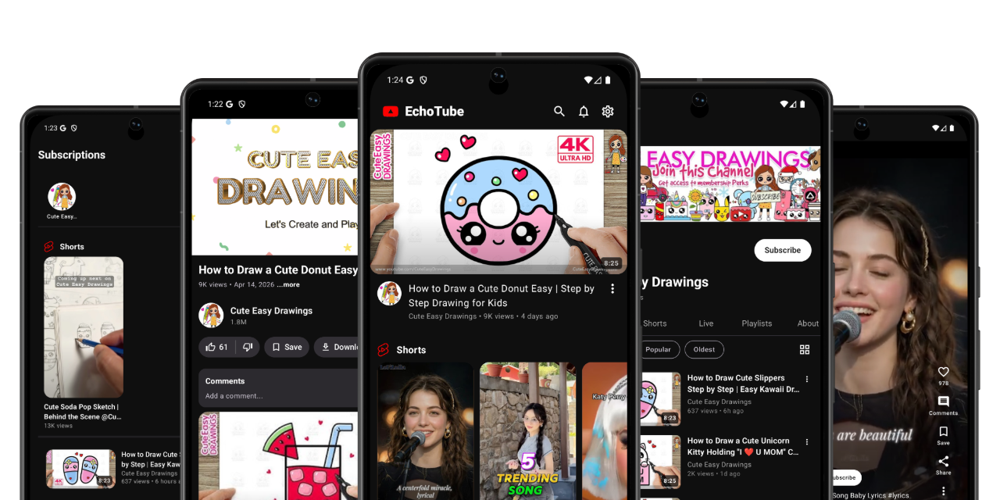
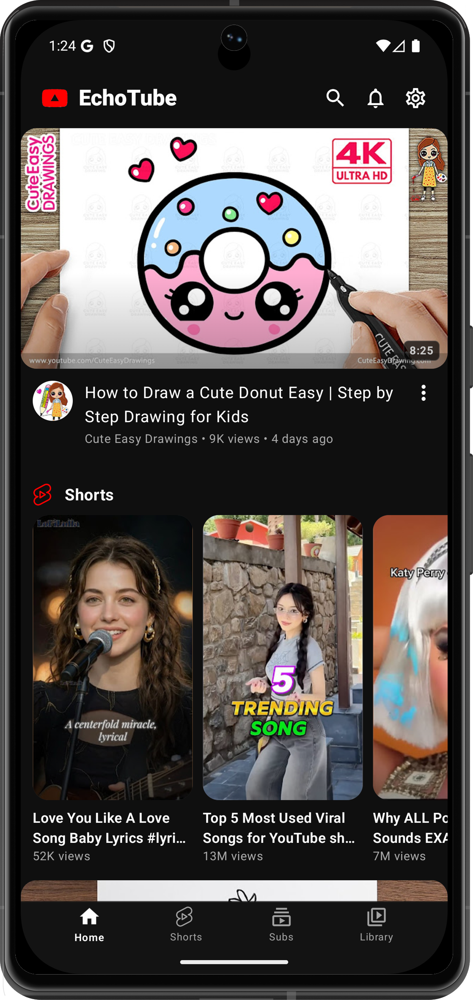
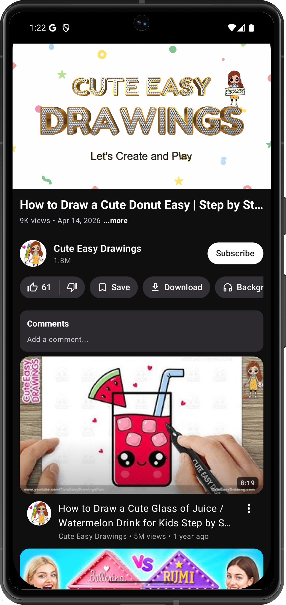
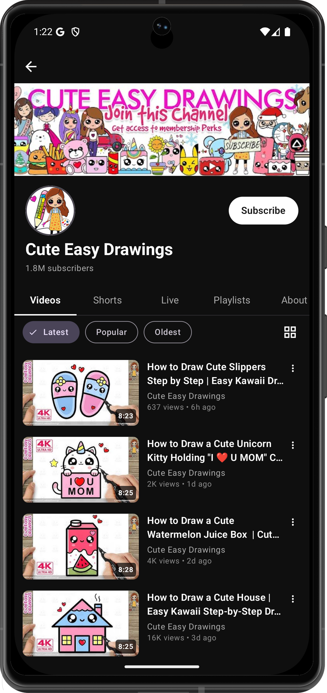
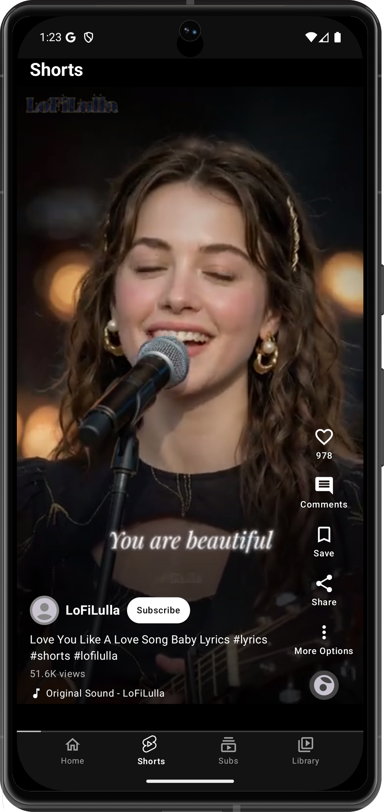
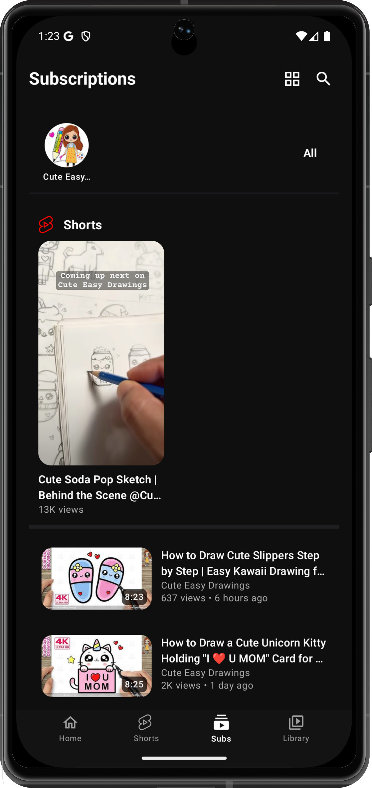
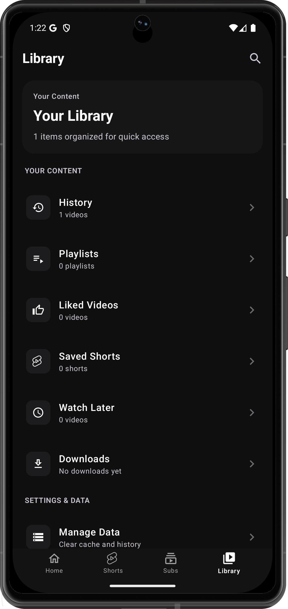
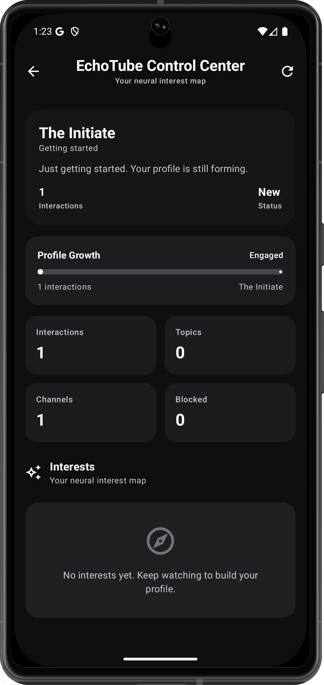

<div align="center">
  

  <h1>EchoTube</h1>

  <p><strong>A robust, open-source Android video client focused on privacy, local intelligence, and an ad-free experience.</strong></p>

  <a href="https://github.com/iad1tya/EchoTube/releases/latest">
    
  </a>
</div>

---

## Overview

EchoTube delivers a fast and modern video experience powered by a fully local recommendation engine. It is built with Kotlin and Jetpack Compose, runs without ads, and gives users full ownership of their data.

---

## Screenshots

<div align="center">
  
  
  
  
  
  
  
</div>

---

## Features

### Video

Playback, controls, accessibility, and offline support.

- High-quality playback via ExoPlayer (Media3) with resolution switching (1080p, 720p, 480p, 360p)
- SponsorBlock auto-skips sponsors, intros, outros, and filler
- Return YouTube Dislikes shows the dislike count on videos
- DeArrow replaces clickbait thumbnails and titles with community alternatives
- Return YouTube Dislike (RYD)
- Background playback for audio with screen off
- Picture-in-Picture (PiP)
- Casting to smart TVs and streaming devices
- Playback speed control (0.25x to 2x)
- Video chapters with seek jumping
- Gesture controls for brightness, volume, and seeking
- Subtitles with customizable font size, color, and background
- Downloads with VP9, AV1, and standard format support
- Resume playback from where you left off

### Recommendations (Echo Brain)

Fully local intelligence with transparent ranking logic.

- Runs 100% on-device with no server, no telemetry, and no account needed
- Learns from watch, skip, like, dislike, search, and watch-time signals
- Distinguishes weekday/weekend and morning/night preferences
- Detects topic fatigue and mixes in new content
- Prevents feed collapse into the same 2-3 topics
- Surfaces related videos from recent watches for natural transitions
- Uses engagement signals (like-to-view ratios) to filter low-quality content
- Full transparency dashboard explaining every recommendation
- Export/import your recommendation profile as a file

### Library

Your viewing data and collections, managed locally.

- Local watch history
- Favorites and custom playlists
- Shorts feed with bookmarking
- Continue Watching shelf
- Subscription management with cached feeds

### Privacy

No lock-in, full ownership, and complete local control.

- No Google account required
- No ads
- All data stored locally on your device
- Import subscriptions and history from NewPipe
- Export or delete everything at any time

---

## Installation

### Android

Download the latest APK from the [Releases Page](https://github.com/iad1tya/EchoTube/releases/latest).

### Build from Source

1. Clone the repository.

```bash
git clone https://github.com/iad1tya/EchoTube.git
cd EchoTube
```

2. Configure Android SDK.

```bash
echo "sdk.dir=/path/to/your/android/sdk" > local.properties
```

3. Firebase setup.

Follow [FIREBASE_SETUP.md](FIREBASE_SETUP.md) to configure Analytics and Crashlytics (`google-services.json`).

4. Build.

```bash
./gradlew :app:assembleGithubDebug
```

---

## Community and Support

Join the community for updates, discussions, and help.

<div align="center">
  <a href="https://discord.gg/d6VPTS5Y4W"></a>
  &nbsp;
  <a href="https://t.me/EchoTubeApp"></a>
</div>

Contact: hello@echotube.fun

---

## Support the Project

If EchoTube has been useful to you, consider supporting its development.

<div align="center">
  <a href="https://buymeacoffee.com/iad1tya"></a>
  &nbsp;
  <a href="https://intradeus.github.io/http-protocol-redirector/?r=upi://pay?pa=iad1tya@upi&pn=Aditya%20Yadav&am=&tn=Thank%20You"></a>
</div>

### Cryptocurrency

| Network | Address |
|---------|---------|
| **Bitcoin** | `bc1qcvyr7eekha8uytmffcvgzf4h7xy7shqzke35fy` |
| **Ethereum** | `0x51bc91022E2dCef9974D5db2A0e22d57B360e700` |
| **Solana** | `9wjca3EQnEiqzqgy7N5iqS1JGXJiknMQv6zHgL96t94S` |

---

## Documentation

- [Contributing Guide](CONTRIBUTING.md)
- [Code of Conduct](CODE_OF_CONDUCT.md)
- [Security Policy](SECURITY.md)
- [Support](SUPPORT.md)
- [Changelog](CHANGELOG.md)
- [Firebase Setup](FIREBASE_SETUP.md)
- [Architecture](docs/ARCHITECTURE.md)
- [Build and Release Guide](docs/BUILD_AND_RELEASE.md)

---

Thanks to the Flow project (https://github.com/A-EDev/Flow) for the inspiration. It played an important role in helping shape and complete this project.

---

<div align="center">
  Licensed under <a href="License">GPL-3.0</a>
</div>
